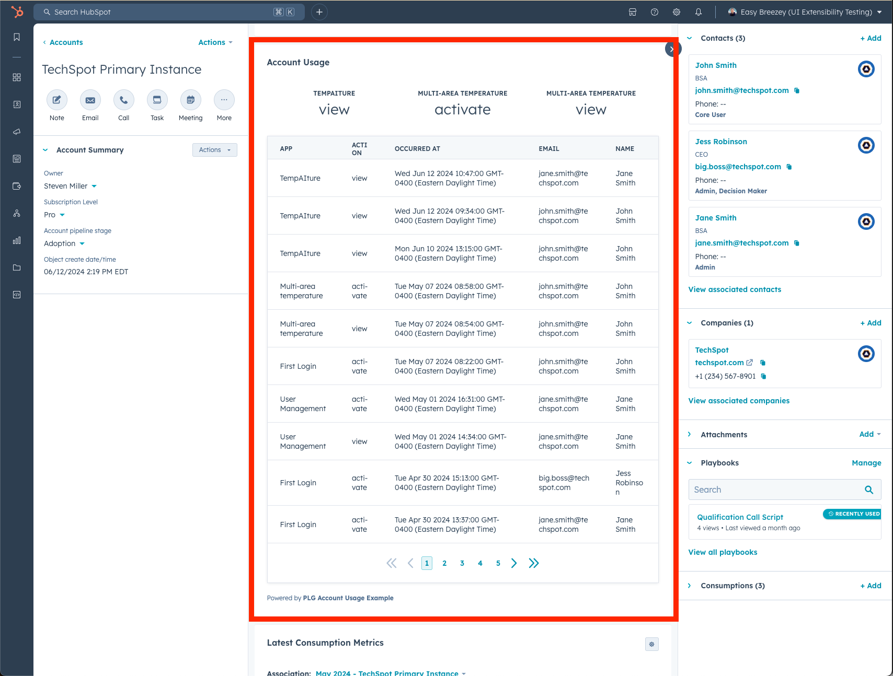

# HubSpot: Aggregate Custom Events on a Custom Object

Summary: this UI extension rolls up HubSpot custom events from contacts associated to a custom object. This is designed for a product-led growth strategy, where you can observe key actions certain contacts have taken inside of your product's accounts and have visibility of those on the "account" level in HubSpot (with account being represented as a custom object).

## Setup: events

You will need to have a custom event on contacts in your portal - the frontend is set up assuming that you will have `app` and `type` custom properties on this custom event, but you could customize that in `Example.jsx`.

The ID of the custom object is set in the top of `example-function.js`

## Setup: custom objects

You will need a custom object called `accounts` that contacts can be associated to. You can change the name of this custom object to better represent your software mechanisms (e.g. maybe you call instances of your software "workspaces" or "portals"), but you will need to change that name in `example-card.json` and the GraphQL query at the bottom of `example-function.js`

## Setup: scripts to run

- `npm install`
- `hs project dev`
